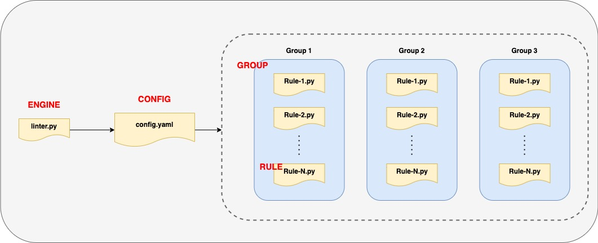

## Description
linter-executor is a simple framework required to execute your own custom Python test-cases.

## About linter-executor

### The main proposal entities:

* **Engine** (linter-engine) - the main entry point/interface for users, a simple python script that realizes and manages the plugin model;
* **Rule** - a rule/test-case is an independent python module that will be imported and executed by the engine;
* **Group** - a set of rules combined by one logical target/idea/etc;
* **Config** - is a base group/rule mapping file + default options/parameters for rules;
* **Run** - a single engine execution that initiates consequences rule executions against a target.



Config includes 4 main default sections:

* **enabled_groups** - a default set of groups will be executed during engine run;
* **excluded_rules** - pattern <group_name>_<rule_name>, a default set of rules will be excluded in engine run;
* **groups** - a map describes group/rule mapping;
* **options** - any kind of data required for rules.

```yaml
---
enabled_groups:
  - example
 
excluded_rules: []
 
groups:
  - name: example
    rules:
      - example_rule
 
options:
  example:
    answer: 42
```

The rule includes several strict requirements (see [example_rule.py](rules/example/example_rule.py) as an example):

* *Rule class name* - should be uniq;
* *Include _execute method* - it's a main rule entry point which Engine uses to run rule logic;
* *setup function* - is being used for importing a module as a plugin, rule_class should be equal to the main Rule class name.
* *description attribute* - it's a rule description that will be provided to output.
* *Condition to return self.passed result (PASS, WARN, FAIL)* - based on this variable rule can fail a pipeline to block MR merge action.

Conditions:
* PASS - returns exit code 0, no block.
* WARN - returns exit code 0, no block.
* FAIL - returns exit code 1, block pipeline.

### Requirements
* Python 3.10+
* Libs from requirements.txt file

### Example

Via arguments:
```bash
./linter.py -p/--repo-path <repo_path> \
            -g/--groups <rule_name> \
            -e/--excluded-rules <group_name>_<rule_name> \
            --verbose
```
Via environment variables:
```bash
export LINT_TARGET_REPO_PATH=<repo_path>
export LINT_ENABLED_GROUPS=<rule_name>
export LINT_EXCLUDED_RULES=<group_name>_<rule_name>
./linter.py --verbose
```
